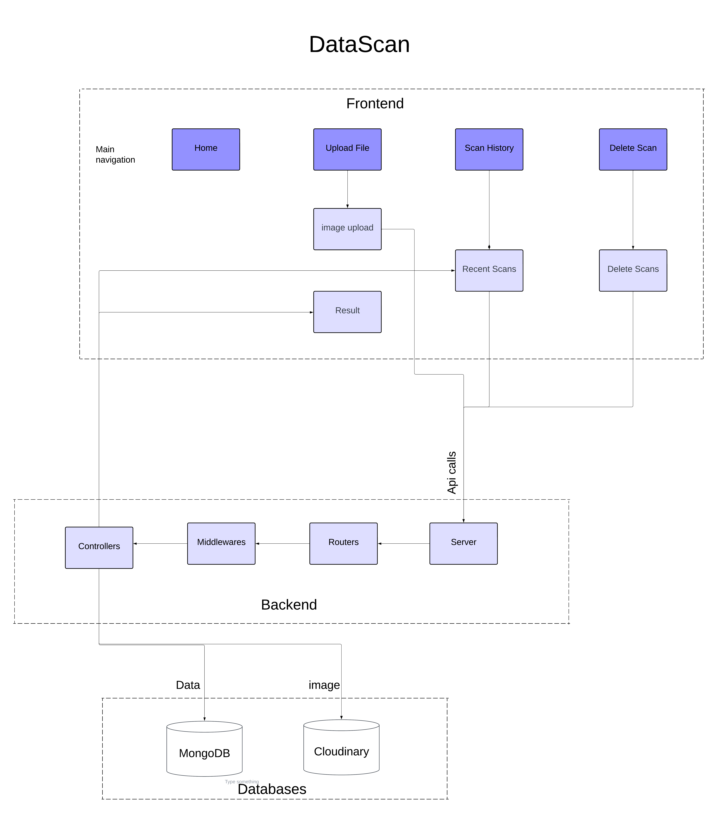
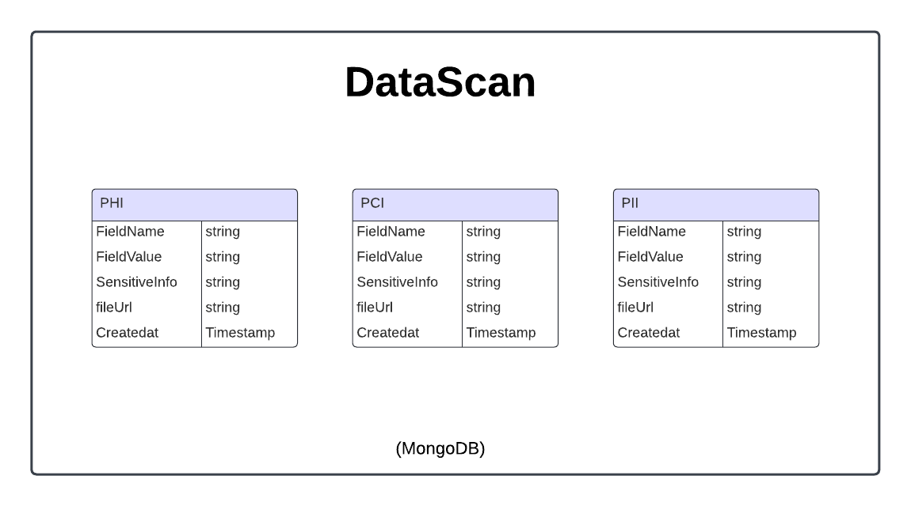

# DataScan: Sensitive Data Identification Tool

## Description
**DataScan** is a web application designed to identify and classify sensitive information in files uploaded from a local machine. The tool scans for data such as PAN card numbers, US Social Security Numbers (SSN), medical record numbers, and more. It provides a dashboard to view scan history, retrieve information, and manage sensitive data securely.

---

## System and Database Design

### System Design


### Database Design


---

## Features
- Upload files for Text-Extraction.
- Identify and classify sensitive data based on text-extracted.
- Maintain a history of scanned files and their results.
- Delete scan information for a specific entity.
- User-friendly dashboard for managing scanned data.

---

## Prerequisites
Before running the project, ensure you have the following installed:
- **Node.js**: v16 or later
- **MongoDB**: Running locally or on a cloud instance
- **Cloudinary**: For file storage
- **AWS SDK**: For additional cloud services (optional)

---

## Setup Instructions

### 1. Clone the Repository
```bash
git clone <repository-link>
cd project_name
```

---

### 2. Install Dependencies in frontend
```bash
cd frontend
npm install
```

---

### 3. Install Dependencies in backend
```bash
cd backend
npm install
```

---

### 4.Configure Environment Variables in backend
- Create a .env file in the backend directory with the following keys:
```bash
port = "4000"
cloud_name = your-cloud-name
cloud_api_key = your-cloud-api-key
cloud_api_secret = your-cloud-api-secret
mongo_uri = mongodb+srv://<username>:<password>@cluster.mongodb.net/<database-name>
```

---

### 5. Add AWS Credentials
- Create a file named aws-credentials.json in the config/ directory.
- Add the following content to aws-credentials.json:

{
  "accessKeyId": your-access-key-id,
  "secretAccessKey": your-secret-access-key,
  "region": your-region
}

---

### 6. Run the Backend
```bash
cd backend
npm run server
```

---

### 7. Run the Frontend
```bash
cd frontend
npm run dev
```
- The application will run on http://localhost:5173

---

## Usage
- Upload File: Navigate to the "Upload File" section and choose a file to scan.
- Scan History: View the list of previously scanned files, including sensitive data found.
- Delete Scan Entity: Remove specific entries from the scan history.

---

## Project Structure
project_name/
├── backend
│       ├── config/
│       ├── models/
│       ├── routes/
│       ├── controllers/
│       ├── middlewares/
│       ├── .env
│       └── server.js
│
├── frontend
│       └── src/
│           ├── components/
│           ├── pages/
│           ├── Context/
│           ├── App.jsx
│           └── main.jsx
│   
├── diagrams/                                     
└── README.md 

---

## Contact
- For questions or support, please contact:
- Nithin S R
- Email: nithinsrhlk@gmail.com

---


